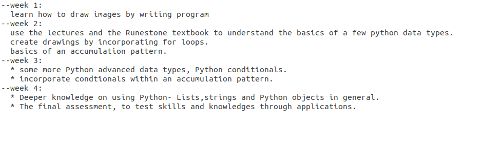

# Auto-Formatted-text-file-generator

## The Text File that will be generated will look similar to this one(in the image):

### The Advantages and Disadvantages

* Advantages:

    1. you can note down large amount of syllabus contents with a good formating
    2. you can enter multiple line inputs
    3. No data loss
    4. This code can run on Linux as well as on Windows Platform.
    5. Works with all Python3 versions

* Disadvantages:
    
    1. It doesn't have a good GUI
    2. User's with absolutely no idea of CLI applications can face little bit problem
    3. Need to follow the exactly same commands to execute the code correctly.

> So please carefully read the instructions from the **instructions.txt** file to successfully execute the code!
